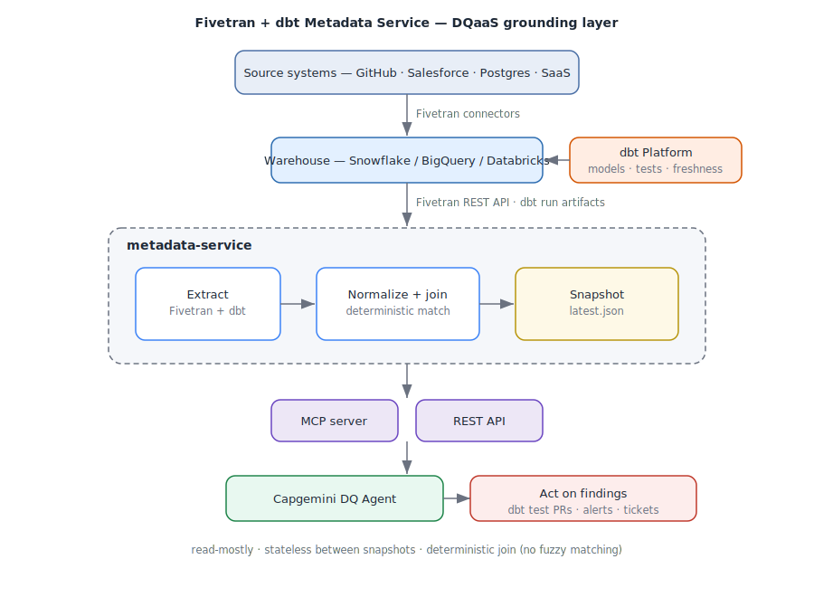
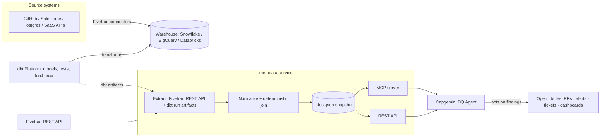
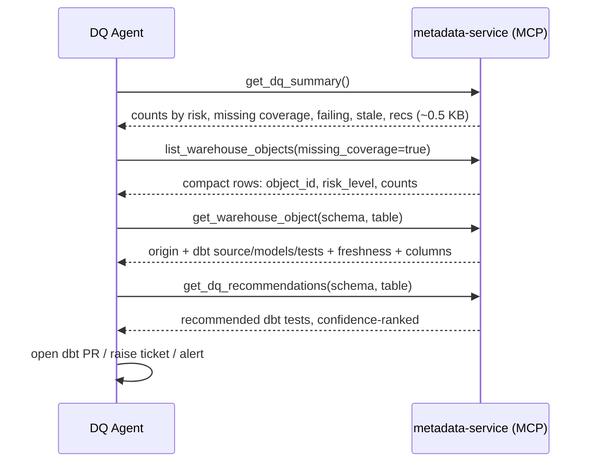

# Capgemini DQaaS — Quickstart & Solution Guide

> The metadata grounding layer for an agentic Data Quality service. It gives your
> DQ agents a single, always-current, queryable picture of **what data exists
> (Fivetran)** and **how it's transformed and tested (dbt)** — so they can reason
> about coverage, freshness, lineage, and risk without scraping APIs themselves.



---

## 1. What it does (in one minute)

Capgemini's agentic Data Quality solution needs to *know the data landscape* before
it can improve it. Today that context is a manually uploaded JSON file. This service
**automates that file** and serves it to agents:

- **Extracts** Fivetran replication metadata (connections, tables, columns, primary
  keys, hashing, sync state) and dbt transformation metadata (models, sources,
  tests, run results, source freshness, lineage).
- **Joins** them deterministically into `warehouse_objects` — each destination table
  linked to its dbt source, downstream models, attached tests, and freshness.
- **Reasons**: generates DQ **recommendations** (which tests to add, which tables
  lack coverage, which syncs are stale, which tests are failing) and **drift** vs.
  the previous snapshot.
- **Serves** it over **MCP** (for agents) and **REST** (for services), plus a CLI.

The output is a single normalized JSON snapshot (`latest.json`) — see the
[JSON contract](../ARTIFACTS.md).

## 2. Where it fits in the DQaaS architecture



The service is the **grounding / context layer**. Capgemini owns the agent and the
*actions* (writing dbt tests, opening PRs, alerting, dashboards); this service owns
the *truth* the agent reasons over. It is read-mostly, stateless between snapshots,
and deploys next to your orchestration.

## 3. How agents use it (the triage flow)

Agents don't pull the whole snapshot (it can be hundreds of KB). They **orient,
triage, then drill in** — each step is a small, targeted call.



### MCP tools

| Tool | Purpose |
|---|---|
| `get_dq_summary()` | **Start here** — account rollup (~0.5 KB) |
| `list_warehouse_objects(schema, risk_level, missing_coverage, failing_tests, stale, limit)` | Compact, filterable triage index |
| `get_warehouse_object(schema, table)` | Full detail for one object |
| `get_dq_recommendations(schema, table, recommendation_type, confidence, risk, limit)` | Per-object or cross-snapshot recommendations |
| `get_schema_drift(schema, table, severity)` | Changes since the previous snapshot |
| `get_latest_metadata(scope)` | Full snapshot (large — prefer the above) |
| `refresh_metadata(...)` | Trigger a new extraction + snapshot |

### The DQ questions it answers

| The agent asks… | Tool / field |
|---|---|
| What source generated this table? Which connection replicated it? | `get_warehouse_object` → `origin` |
| Which dbt models depend on this source? | `dbt.model_unique_ids` (lineage) |
| Which tests exist? Which are failing? | `dbt.tests[].status`, `dq_summary.failing_tests_count` |
| Is source freshness passing? | `dbt.freshness.status` |
| Which tables are enabled in Fivetran but have no dbt tests? | `list_warehouse_objects(missing_coverage=true)` |
| What dbt tests should we add? | `get_dq_recommendations` (confidence-ranked) |
| Which columns are primary keys / hashed / sensitive? | `columns[].is_primary_key`, `columns[].hashed` |
| Did the schema drift since last run? | `get_schema_drift` |

## 4. 5-minute quickstart

```bash
# install (uv recommended — reproducible from uv.lock; pip/venv also works)
uv sync --all-extras

# try it with zero credentials (bundled fixtures)
./examples/demo.sh

# OR run against live systems
cp .env.example .env          # fill in FIVETRAN_* and DBT_* creds
uv run metadata-service build --group-id <fivetran_group> --dbt-project-id <dbt_project_id>

# serve to agents
uv run metadata-service serve-mcp                               # local (stdio)
uv run metadata-service serve-mcp --transport http --port 8765  # hosted -> http://host:8765/mcp

# run the example agent
uv run python examples/agent_quickstart.py
```

> Prefer pip? `python -m venv .venv && source .venv/bin/activate && pip install -e ".[dev,mcp]"`,
> then drop the `uv run` prefix.

See [examples/](../examples/) for the runnable agent client, REST curl script, and
the offline demo.

## 5. What a real run looks like

From the live reference build (GitHub → Fivetran → Snowflake → dbt), `get_dq_summary()`:

```json
{
  "object_count": 76, "matched": 7, "unmatched": 69,
  "risk_levels": {"low": 3, "medium": 73, "high": 0},
  "objects_with_failing_tests": 0,
  "objects_missing_dbt_coverage": 69,
  "recommendations": {"total": 223, "by_type": {"dbt_test": 157, "risk": 66}},
  "drift": {"total": 18, "by_severity": {"low": 18}}
}
```

A matched object (`github.issue`) comes back fully joined — Fivetran origin, dbt
source, downstream models via lineage, attached tests with pass/fail status, and
source freshness. The full walkthrough is in
[docs/use-cases/github-snowflake-dbt.md](use-cases/github-snowflake-dbt.md).

## 6. Deploying for production

- **Keep the snapshot fresh.** Schedule `metadata-service build ...` (cron / Airflow
  / dbt Cloud job webhook) after your dbt production runs land. Agents always read
  the latest snapshot.
- **Storage.** `local` by default; set `METADATA_STORAGE_BACKEND=s3` (with
  `METADATA_S3_BUCKET`) to share snapshots across a fleet.
- **Serve.** Run `serve-mcp --transport http` as a long-lived service for hosted
  agents, or register the stdio command in each agent runtime.
- **Scope.** Use `--group-id` (Fivetran) and `--dbt-project-id` to target exactly the
  estate the agent owns — important on large shared accounts.

## 7. Boundaries & assumptions

- **Read-mostly.** The service reads metadata and recommends; it does not write dbt
  tests or change Fivetran/dbt. Those actions are the agent's (and easy to wire from
  the recommendations).
- **Deterministic matching** (no fuzzy joins) — see `match_confidence`. Use the
  `aliases` map for known exceptions.
- **Primary keys** come from Fivetran where the config API exposes them. Some
  connectors (e.g. GitHub) don't — so for authoritative PKs (incl. composite keys)
  enable the optional Snowflake **warehouse reader** (`WAREHOUSE_TYPE=snowflake` +
  `WAREHOUSE_*`), which reads the Platform Connector's `fivetran_metadata` schema.
  The standalone Metadata REST API is deprecated.
- **dbt metadata** is read from **run artifacts** (manifest/catalog/run_results/
  sources), so a deployment job must have run.

## 8. More

- [README](../README.md) — full service docs, CLI, REST, MCP
- [ARTIFACTS.md](../ARTIFACTS.md) — the JSON output contract, field by field
- [Reference build](use-cases/github-snowflake-dbt.md) — the live end-to-end
- [examples/](../examples/) — runnable agent + REST + demo
